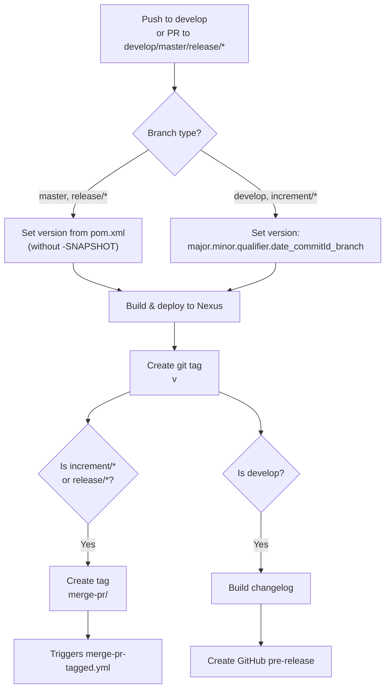
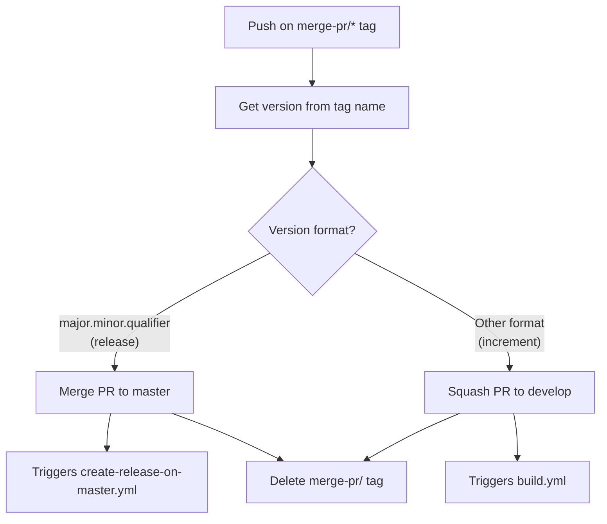
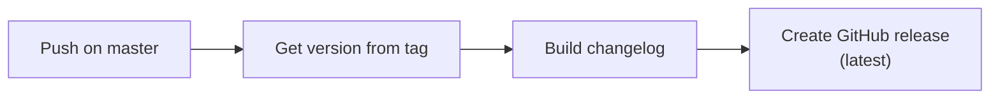
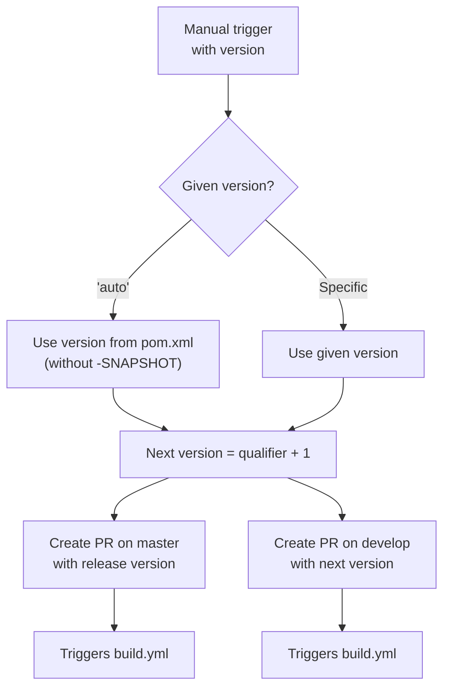
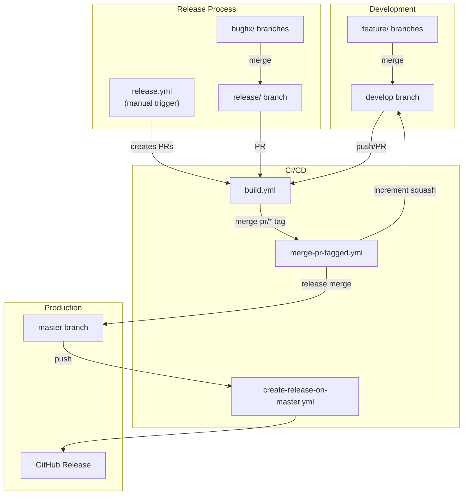

# CI/CD Flow and Branching Strategy

This document describes the Git branching strategy and GitHub Actions CI/CD pipelines used by the project. The workflow is based on GitFlow with automated build, test, deploy, and release processes.

## Branch Strategy

The project uses a GitFlow-based branching model. All development happens on `develop`, releases are cut from release branches, and `master` always reflects the latest production release.

| Branch Pattern | Base Branch | Purpose |
|---------------|-------------|---------|
| `develop` | — | Main development branch; latest active-version sources |
| `feature/JNG-<number>_<summary>` | `develop` | New features for the next release |
| `release/<version>` or `<version>` | `develop` | Stabilization branch for an upcoming release |
| `bugfix/JNG-<number>_<summary>` | release branch | Fixes applied during release testing (before merge to master) |
| `support/JNG-<number>_<summary>` | release branch | Minor changes to a previous release |
| `hotfix/JNG-<number>_<summary>` | `master` | Critical fixes applied to both master and develop |
| `master` | — | Latest released version |

```mermaid
gitGraph
    commit id: "initial"
    branch develop
    commit id: "dev-1"
    branch feature/JNG-1
    commit id: "feat-1"
    commit id: "feat-2"
    checkout develop
    merge feature/JNG-1
    commit id: "dev-2"
    branch release/1.0
    commit id: "rc-1"
    branch bugfix/JNG-4
    commit id: "fix-1"
    checkout release/1.0
    merge bugfix/JNG-4
    checkout develop
    merge release/1.0
    checkout master
    merge release/1.0 id: "v1.0"
    checkout develop
    commit id: "dev-3"
```

## Version Numbers

Versions follow semantic versioning with these rules:

| Event | Version Change |
|-------|---------------|
| Start a `feature/` branch | No version change |
| Start a `release/` branch | 2nd number on `develop` incremented |
| Start a `bugfix/` branch | No version change (applied to release branch pre-release) |
| Start a `support/` branch | 3rd number incremented |
| Start a `hotfix/` branch | 4th number incremented |

On `develop` and `increment/*` branches, the version includes a timestamp and commit ID: `major.minor.qualifier.date_commitId_branchName`.

On `master` and `release/*` branches, the version is the clean semantic version from `pom.xml` (without `-SNAPSHOT`).

## GitHub Actions Workflows

### build.yml — Build, Test, Deploy

This is the main CI workflow. It triggers on pushes to `develop` and pull requests targeting `develop`, `master`, `increment/*`, or `release/*`.



### merge-pr-tagged.yml — Auto-Merge Pull Requests

Triggered when a `merge-pr/*` tag is pushed. Routes the merge based on version format.



### create-release-on-master.yml — Create Production Release

Triggered by pushes to `master`. Creates the official GitHub release with a changelog.



### release.yml — Start a Release

Manually triggered with a version number (or `auto` to use the version from `pom.xml`).



### Complete Workflow Interaction



## Development Rules

> **Important:** Every commit must include a JIRA ticket number (e.g., `JNG-123`). There is no commit without a ticket number.

Issue tracking is managed in [JIRA](https://blackbelt.atlassian.net/jira/dashboards).
